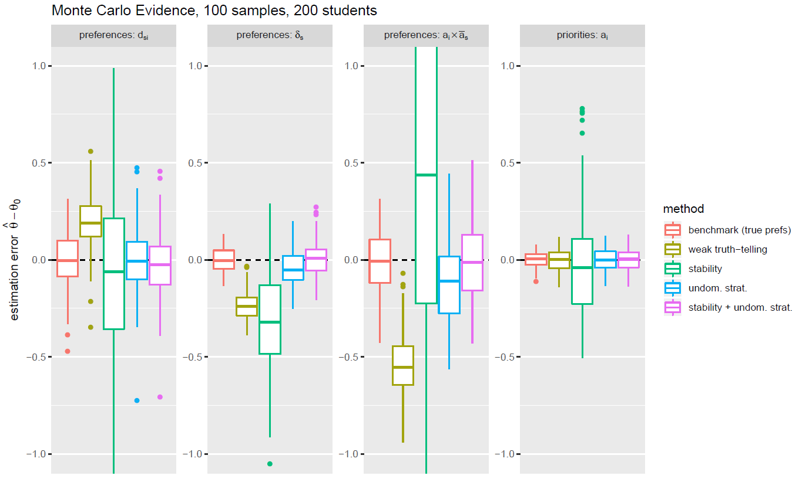

# Introduction

We describe a method to estimate preferences in a many-to-one matching market, such as a school choice market. When estimating students' preferences and schools' priorities from observational data in school markets, a number of problems typically arise. This documentation is based in large parts on @Aue2020, which also includes more theoretical background and an application of the method to the Hungarian secondary school choice market.

The first problem that needs to be addressed is about estimating students' preferences: although in the SOSM it is a weakly dominant strategy for students to report their complete rank-order lists (ROLs) of schools truthfully, stated ROLs may differ from the real ones because students submit strategic ROLs by either omitting schools which they deem unattainable or by truncating their ROLs if they are confident to be assigned to more preferred schools. Both types of omissions have been consistently observed in the field [@chen2019] and in the lab [@castillo2016truncation]; and are particularly important for us because the average student in Budapest ranks only 4 schools, even when they are allowed and encouraged to rank all schools. The fact that students submit only short preference lists is the reason why we need a parametric approach to construct ``true'' complete rank order list. But the fact that students may omit some of their top-ranked schools renders standard approaches to estimates multinomial preferences inapplicable.

A second closely linked technical complication is about estimating schools' priorities: Hungarian schools only report priorities over the set of students who actually apply to them and not over the entire set of students. Thus, even though @fack2019beyond have recently shown how to estimate students' preferences without assuming truth-telling behavior, we cannot directly apply their discrete choice methods which rely on observing complete schools' priorities over students (for example, when schools' priorities are based on a centralized exam). In Hungary, and many other countries, schools' priorities are based on tests, interviews, and previous grades with weights decided by each school (subject to basic guidelines).

To overcome these technical challenges in preference estimation, our empirical strategy builds on two identifying assumptions.  Our first assumption is that the observed assignment is stable, which implies that a student's assigned school must be her top choice among her ex-post feasible schools (and vice versa for schools). We apply a stability-based estimator, similar to @fack2019beyond and @akyol2017preferences. In their settings, ex-post feasible choice sets can be constructed because each student's priority at every school is observed. This is not the case in our setting, where students' and schools' feasible choice sets are latent and therefore need to be endogenized to point-identify parameters.^[In the case where schools are not strategically submitting priority lists, a two-step approach to this problem could be derived from @he2019application: First, estimate school priorities for all students using schools' observed ranking over applicants. Second, use the estimated priorities to construct personalized choice (or consideration) sets and apply the estimation strategy in @fack2019beyond.]
Our second identifying assumption is that students use undominated strategies, i.e. a school is ranked above another one if the former is preferred to the latter. The submitted ROLs then reveal the true partial preference order of students over schools [@haeringer2009constrained]. 
The method is implemented as a Gibbs sampler that imposes bounds on the latent match valuations that are derived from stability and from the observed ROLs. This approach generalizes the matching estimator, proposed in @Logan2008 and @Menzel2013 for the marriage market, from a one-to-one matching to a many-to-one matching setting, which is suitable for the school admissions problem studied in this paper. 
We test our proposed estimation method in Monte-Carlo simulations, and we find that it yields unbiased estimators for students' preferences and schools' priorities. Our estimator is implemented in R and C++, and is available online.^[[https://github.com/robertaue/stabest](https://github.com/robertaue/stabest)]

# Related Literature

Several authors have devised methods for preference estimation with more or less restrictive underlying assumptions. The most common identifying assumption is truth-telling, where under the SOSM, a student is truth-telling if she submits her $k$ most preferred schools. [@abdulkadirouglu2017welfare, p.3657; and @che2019efficiency], for example, follow this assumption in their analysis of the New York City high school match. However, truth-telling is only a weakly dominant strategy, even when schools can be listed at no cost. Commonly observed and rationalizable strategies that are inconsistent with truth-telling include skipping "infeasible" schools and truncating ROLs after "safe" schools. Therefore, other identifying assumptions have been explored in the literature.

A less restrictive identifying assumption is that students do not submit dominated ROLs. This assumption is due to the fact that it is a strictly dominated strategy in the student-proposing Gale Shapley mechanism to rank school $s'$ before school $s$ if a student actually prefers school $s$ over school $s'$ @haeringer2009constrained. @fack2019beyond [p.1507] argue that an econometric model based on undominated strategies is incomplete in the sense of @tamer2003incomplete, because "the assumption [[...]] does not predict a unique ROL for the student". They conclude that this assumption does not permit point identification of preference parameters. We beg to differ on this statement, and will outline our argument the next section below.

Another commonly used identifying assumption is stability of the observed matching, which implies that a student's assigned school must be her top choice among her ex-post feasible schools. @artemov2017strategic argues that stability is a more innocuous assumption than undominated strategies in that it permits inconsequential "mistakes" (in the sense of playing dominated strategies).
Also, asymptotic stability of the matching is guaranteed ex-post under fairly general conditions [@fack2019beyond]. The most pervasive problem for stablity-based inference in two-sided matching models is that stable matching games may possess multiple (stable) equilibria for a given set of preferences. This constitutes a problem because standard empirical models do not specify the equilibrium selection rule. A model specifying stability is therefore incomplete @tamer2003incomplete. For the most part, the literature has therefore focussed on complete models  [see, @Fox2009, for surveys of the literature; @chiappori2016econometrics]. One means to ensure uniqueness of the stable matching (and therefore completeness of the model) is to impose assumptions restricting the form of utility functions. This approach is followed by @Sorensen2007, who assumes preferences on both sides of the market to be pairwise aligned in the two-sided matching of firms and venture capitalists; @Chen2013, who assumes a global ROL on one side of the market for corporate loans (which is a special case of pairwise alignment); and @agarwal2015empirical, who restricts programmes' preferences for medical residents to be homogeneous in the US medical match. Likewise, @Agarwal2014 show that preferences are non-parametrically identified in many-to-one matching markets with perfectly aligned preferences.
Another means to ensure uniqueness is to focus on contexts where it is given by the design of the admissions process. In the context of school choice and college admissions, several papers exploit the score-based admissions priorities used by educational authorities, which guarantee a global ROL and a unique stable matching. For school choice, this has been applied for Paris [@fack2019beyond], for college admissions in Mexico [@Bucarey2018], Turkey [@akyol2017preferences] and Norway [@Kirkeboeen2012].
A number of other papers are concerned with the estimation of preferences based on observational data from matching markets. For example, @Logan2008 and @Menzel2013 examine preferences for assortative matching in marriage markets. @menzel2015large shows that the match surplus can be identified parametrically by means of a constrained maximum likelihood estimator that utilizes mathematical programming with equalities constraints (MPEC). @Weldon2016 also discusses identification of preference parameters in school choice markets, and also provides some Monte Carlo evidence on the convergence properties of stability-based estimators. He finds that estimation routines that rely exclusively on the observed matching being stable can be rather slow to converge as the student-school ratio becomes larger.

Our methodological contribution to the literature lies in developing a method to simultaneously estimate the parametric form of students' preferences and schools' priorities in such settings where only partial ROLs and the final assignment are known to the econometrician, but where preferences and priorities are not perfectly aligned. We follow the approach of @fack2019beyond in that we use the stability assumption in conjunction with the undominated strategies assumption. Their approach, however, is not directly applicable to our setting where the students' feasible choice sets are unobserved, and so we extend their approach to include latent feasible choice sets using a data augmentation approach. This approach is motivated by @Logan2008, @Menzel2013, and @Weldon2016.


# Method

We observe a school choice market with a set of students $T$ and a set of schools $S$. We posit that the students' utilities over the set of schools, $U_t(s)$, and schools' valuations over the set of students, $V_s(t)$ take the following parametric form:
\begin{align}
	U_{t}(s) &= U_{t0} + \mathbf{X}_{ts}\beta + \epsilon_{ts} \\
	V_{s}(t) &= V_{s0} + \mathbf{W}_{st}\gamma + \eta_{st}
\end{align}
where $\mathbf{X}_{ts}$ and $\mathbf{W}_{st}$ are observed characteristics that are specific to the school-student match $st$ that could, for instance, include a school fixed effect. The terms $U_{t0}$ and $V_{s0}$ are the outside utilities of not being matched to any student or school. These are assumed to be zero, so that the latent utilities represent the net utility of being matched. The match valuations $U_t(s)$ and $V_s(t)$ are treated as latent variables that are to be estimated along with the structural parameters $\beta$ and $\gamma$. Throughout, we will denote by $\mathbf{U}_t$ the vector of student $i$'s utilities over the entire set of schools, and by $\mathbf{V}_s$ school $s$'s valuations over the entire set of students. 
%We assume that our data are ordered by schools first and students second, so that $\mathbf{U}$ and $\mathbf{V}$ denote vectors over the entire set of utilities and valuations with and index $k$ that refers to the same pair of students and schools, *i.e.* $\mathbf{U}_k=U_i(s)$ if and only if $\mathbf{V}_k=V_s(i)$. The same indexing convention will be applied to covariate matrices $\mathbf{X}$ and $\mathbf{W}$, and on the vectors of structural errors $\mathbf{\epsilon}$ and $\mathbf{\eta}$.  
We make use of the common indexing notation whereby the elements of some vector $\mathbf{Z}$ that do not refer to the student-school pair $ts$ are denoted by $\mathbf{Z}_{-ts}$, i.e. $\mathbf{U}_{-ts}$ denotes the entire set of utility numbers but for $U_t(s)$.
We further assume that the structural error terms $\epsilon_{ts}$ and $\eta_{st}$ are independent across alternatives, and normally distributed with unit variance. While one could in principle allow for more general correlation structures, it is customary (and necessary) in the discrete choice literature to put some structure on the error terms in order to ensure identification [@Train2009]. We also think that including a sufficiently rich set of controls and co-variates allows us to model the dependencies across alternatives in a more transparent manner than if we had left the co-variance structure completely unspecified.

Some more notation will be convenient below. The econometrician observes students' submitted partial rank order lists over schools, $\mathbf{rk}$, and schools' submitted partial priority orderings over students, $\mathbf{pr}$. Following the notation of Fack et al., we denote the observed rank order list of student $t$ as $L_t = (s_t^1, s_t^2, \ldots, s_t^{K_t})$, where $s_t^k\in \mathcal{S}$ is some school. Denote the rank that student $t$ assigns to school $s$ as $rk_t(s)$, with $1 \leq rk_t(s) \leq K_t$ if $s \in L_t$ and $rk_t(s) = \emptyset$ else. The observed rank order lists $\mathbf{rk}$ encompass all individually observed rankings $rk_t(s)$. Similarly, denote the set of students who apply to school $s$ as $L_s$, and let the the priority number that school $s$ assigns to student $t$ be $pr_s(t)$. Priority numbers are like ranks, in that they take discrete values, and a lower priority number means higher priority. Schools are required to prioritize all students who apply to them, but they may rank some students as ``unacceptable''. We say that $pr_s(t)=+\infty$ if student $t$ is unacceptable to school $s$, and $pr_s(t)=\emptyset$ if student $t$ did not apply at school $s$. Thus, $pr_s(t) \in \{1,2,\ldots,|L_s|,\infty,\emptyset\}$.

Given the specification of the error terms and the observed rankings, $U_t(s)$ and $V_s(t)$ could be estimated by means of two distinct rank-ordered probit models [@Train2009, p.181]. However, the complications outlined in the introductory part of this article imply that an estimation as such is unlikely to succeed in obtaining the true preference parameters. Because schools only rank students who apply to them, and geographical distance is not an admission criterion, we cannot follow the approach of @Burgess2015 to construct the feasible choice set of each student in order to identify her true preferences. For the same reason, the construction of the stability-based estimator that is proposed in @fack2019beyond cannot by applied. Still, we follow Fack et al. in that we use a combination of identifying assumptions to identify the model parameters. These will be described in turn. We chose a Bayesian data augmentation approach, owing to its flexibility, and because it allows us to directly estimate the latent variables $\mathbf{U}$ and $\mathbf{V}$ which are our prime objects of interest for the purpose assessing the gains of integration. Similar approaches have been used by @Logan2008 and @Menzel2013 in the context of one-to-one matching markets. Following [@Lancaster2004, p.238], who describes a data augmentation approach for an ordered multinomial probit model, we simulate draws from the posterior density of the structural preference parameters $p(\beta,\gamma|data)$ by considering the component conditionals $p(\mathbf{U}|\beta,\gamma, \mathbf{V}, data)$, $p(\mathbf{V}|\beta, \gamma, \mathbf{U}, data)$, $p(\beta|\gamma,\mathbf{U},\mathbf{V},data)$ and $p(\gamma|\beta,\mathbf{U},\mathbf{V},data)$. We assume a vague prior for the structural preference parameters $\gamma$ and $\beta$. Details of the conditional posterior distributions are spelled out in the appendix.
Our *data* comprises of the co-variates $\mathbf{X}$ and $\mathbf{W}$, of the assignment $\mu$ and of the submitted rank order and priority lists. In general, the Gibbs algorithm to sample for the posterior density can be described as follows:

* for all $t,s$: draw $U_t(s)$ from $p(U_t(s)|\beta,\gamma, \mathbf{U}_{-ts},\mathbf{V}, data) = N(\mathbf{X}_{is} \beta,1)$, truncated to $[\underline{U}_{t}(s),\overline{U}_t(s)]$
* for all $s,t$: draw $V_s(t)$ from $p(V_s(t)|\beta,\gamma, \mathbf{V}_{-st},\mathbf{U}, data) = N(\mathbf{W}_{st} \gamma,1)$, truncated to $[\underline{V}_s(t),\overline{V}_s(t)]$
* draw $\beta$ from $p(\beta|\gamma,\mathbf{U},\mathbf{V},data) = N\left(b, (\mathbf{X}'\mathbf{X})^{-1}\right)$, with $b=(\mathbf{X}'\mathbf{X})^{-1} \mathbf{X}' \mathbf{U}$
* draw $\gamma$ from $p(\gamma|\beta,\mathbf{U},\mathbf{V},data) = N\left(g, (\mathbf{W}'\mathbf{W})^{-1}\right)$, with $g=(\mathbf{W}'\mathbf{W})^{-1} \mathbf{W}' \mathbf{V}$
* repeat steps 1--4 $N$ times

Key to our estimation methodology are the truncation intervals $[\underline{U}_t(s),\overline{U}_t(s)]$ and $[\underline{V}_s(t),\overline{V}_s(t)]$. These intervals are functions of the data and of the latent variables in the model, and they are specific to the particular set of identifying restrictions that is used. The bounds of these intervals could be very tight, or they could encompass the entire real line. We describe the various kinds of identifying restrictions below, and outline how they can be used to construct these truncation intervals; a detailed derivation of the truncation intervals is deferred to the appendix.


### Weak truth-telling (WTT)

Weak truth-telling requires that the student truthfully submits his or her top-$K_t$ choices, and that any unranked alternative is valued less than any ranked alternative. Formally, this implies that $U_i(s) \geq U_i(s')$ if (but not only if) $rk_t(s) < rk_t(s')$ or $s' \notin L_t$. That is, any unranked school is assumed to be less preferable than any ranked school. A similar reasoning can be applied to schools' priorities over students, with the difference that a school $s$ cannot rank a student $t$ unless $t$ applies to $s$. However, a school can label a student as ``unacceptable'' which implies that all students labelled in this manner are valued less than any other ranked student. So we can bound $V_s(t) \geq V_s(t')$ if $s \in L_t \cap L_{t'}$ and $pr_s(t) < pr_s(t')$ or $pr_s(t')=+\infty$. Taken together, these bounds pin down the truncation intervals and the component conditionals in steps 1 and 2 above.


### Undominated Strategies (UNDOM)}

The assumption of undominated strategies is similar to that of weak truth-telling, but is restricted to the submitted rank order lists. That is, we can bound $U_t(s) \geq U_t(s')$ if $s,s' \in L_t$ and $rk_t(s) < rk_t(s')$. The bounds for the school's valuation over students are the same as in the weak truth-telling case because a school cannot decide to not rank a student; it must at least decide whether the student is acceptable or not. Undominated strategies is thus a weaker, but also more general, condition than weak truth-telling in the sense that the former implies the latter, but not vice versa.


### Stability

If we assume that the matching of students to schools is *stable*, a different set of bounds can be applied to the latent valuations. Denote the observed matching as $\mu$ such that $\mu(t)=s$ and $i\in\mu(s)$ if student $t$ is assigned to school $s$. Stability implies that there is no pair of a student $t$ and a school $s$ such that $V_s(t) > \min_{t' \in \mu(s)} V_s(t')$ (so there is no school $s$ that would like to see student $t$ enrolled rather than one of its currently enrolled students) and $U_t(s) > U_t(\mu(t))$ (no student $t$ would prefer being enrolled at $s$ rather than at his current school). This condition implies that we can bound the realization of $U_t(s)$ conditional on the matching $\mu$, and on the match valuations $\mathbf{U}_{-ts}$ and $\mathbf{V}_{-ts}$. Analogous bounds can  be placed on $V_s(t)$ with straightforward extensions for cases where schools are not operating at full capacity. These bounds are spelled out in the appendix in greater detail. This identifying assumption can be used on its own, or in conjunction with the assumption of undominated strategies.


## Identification

@fack2019beyond provide an illuminating discussion of the merits of different estimation procedures in the Paris school choice context where students' priorities at all schools are observed by the econometrician, and we draw on their insights below. They argue that in the Paris setting, the identifying restriction *stability* alone allows for point-identification in large markets,^[@Weldon2016 [p.158] studies identification of preference parameters using stability-based estimators in a large number of small independent matching markets, and concludes that identification depends strongly on the precise parameter configurations of the matching agents.] but can also be used in conjunction with *UNDOM*. While we characterize our estimation approach in the same terms as they do, our setting differs from theirs in that the students' relative rankings at various schools is only incompletely observed. Our preferred identifying assumption is the combination of undominated strategies and stability because it allows point identification, and it guarantees that the observed matching $\mu$ is stable under the estimated latent match valuations. This stability property is desirable because it allows us to replicate the observed matching by computing the SOSM based on priority and preference lists that are computed from the estimated latent match valuations.

The usual conditions on identification in additive random utility models apply, and preference parameters are identified up to the variance of the unobserved random utility component which we restrict to unity. In these models, only utility differences are identified, and so we can identify only up to $J-1$ alternative specific constants in a choice situation with $J$ alternatives, with one constant being normalized to zero. Moreover, only the interaction of characteristics of the decision maker with alternative-variant characteristics is identified. Furthermore, since only utility differences matter, only the differences of the error terms are identified. This is handled implicitly in our data augmentation approach, by drawing the errors subject to lower and upper bounds that are implied by the observed rank order lists. Lastly, parameters are only identified if there is sufficient heterogeneity in the observed choices: If everyone were to choose the same option, then any parameter which leads to this option being assigned a utility of plus infinity could rationalize what is observed in the data. [@Train2009;@CameronTrivedi2005]

Preference parameters under the identifying restriction of weak truth-telling can in principle be identified by means of a rank ordered model where the choice set encompasses the entire set of schools.^[Variants of this are the rank ordered logit model [@Beggs1981] or a rank ordered probit model [@Yao1999]. Whereas the rank ordered logit model has analytically tractable expressions for the likelihood, the rank ordered probit model has not, and thus requires simulation or Bayesian estimation techniques.]
However, because students may omit some of their most preferred schools if chances of admission are small, this assumption is often violated and parameter estimates are biased in such a model [@fack2019beyond]. To see this, consider some very popular school $s^+$ to which chances of admission are so small that most students, although they would rank it first, never actually include it in their submitted ROL. But then, the probability that school $s^+$ is the most preferred option differs from the probability that it is ranked first, and so the likelihood is misspecified. % because it is written in terms of the probability that school $s$ is the most preferred option, as opposed to being the first item in a student's ROL. 

The alternative, and weaker, identifying assumption of undominated strategies merely makes a statement about how likely it is for an individual student to prefer school $s$ over school $s'$, given the student's and the schools' observable characteristics. This probability can be identified non-parametrically from the observed ROLs, conditional on $s$ and $s'$ being part of the submitted ROL, even if some top choices, or some very unattractive alternatives, were omitted due to strategic reasoning. If we assume that the student's decision to include both $s$ *and* $s'$ in her ROL is independent of whether she ranks $s$ or $s'$ higher, then these conditional non-parametric estimates can be matched to the unconditional model-implied probabilities, and hence the model is completely specified. Therefore, the coefficients on alternative-varying covariates can in principle be identified by their relative contribution to the probability that a particular choice $s$ is ranked before an alternative $s'$. Of course, the usual limitations that apply in multinomial choice models also apply here; for example, preference parameters are only identified up to the scale of the error variance.
In this regard we deviate from @fack2019beyond [p.1507] who argue that an econometric model based on undominated strategies is incomplete because "the assumption (...) does not predict a unique ROL for the student", and thus does not permit point identification of preferences parameters.

If, in addition, one is willing to make the assumption that the observed matching is stable with respect to the decision makers' true preferences, this stability assumption can serve as an additional source of identification. To illustrate this, consider some school $s^-$ which is so unpopular that only few students have included it in their ROLs. Because of this, the probability that this school is preferred to some other school $s'$ is only poorly identified, and this could lead to large uncertainties in the parameter estimates. But if school $s^-$ has some vacant seats, stability of the observed matching implies that no other student prefers this school over her currently assigned school. In general, the stability assumption imposes additional bounds on a student's latent match valuation if some school has vacant seats and if the student is matched to another school; or if a school's latent valuation of this student is larger than the least valued student who is currently assigned to that school. Similar considerations apply for the bounds on schools' valuations over students. So, the stability assumption places additional identifying restrictions on the distribution of latent errors and structural parameters.


## Monte-Carlo evidence
Complementary to the above discussion on identification, we present Monte Carlo evidence below to show that our method works as intended. Specifically, we compare various estimation approaches that are based on different identifying assumptions as laid out above, and we show that a combination of stability and undominated strategies allows us to obtain unbiased parameter estimates with a reasonably small variance.  A more detailed discussion of this Monte-Carlo study is given in @Aue2020.

The data generating process of our Monte Carlo study is borrowed from @fack2019beyond,^[Their data generating process is described, and the code is made available, in their online appendix.] but with slight adjustments. We consider a school market with $T = 200$ students and six schools with a total capacity of $0.95 \cdot T$ seats, so there is slight excess demand.^[This is an artefact of the way in which the data were generated by Fack et al.'s procedure. Future work should examine how a relaxation of this assumption affects the results presented here.] Students' utility over schools is given by
\[
	U_{t}(s) = \delta_s - d_{ts} + 3 \cdot (a_t \cdot \bar{a}_s) + \epsilon_{ts}
\]
where $\delta_s$ is a school fixed effect, $d_{ts}$ is the distance from student $t$ to school $s$, $a_t$ is the students' grade and $\bar{a}_s$ is the average grade of all students at school $s$ (or put differently, the schools' academic quality). Hence, the true preference parameter in the data generating process is $\beta_0 = (1,-1,3)'$. 
$\epsilon_{ts}$ follows a standard normal distribution. For the exposition, we assume that $\delta_s$ is known to the econometrician and therefore enters the estimation as an additional co-variate. The schools' valuation over students (which translates into the students' priorities) is given by
\[
	V_s(t) = a_t + \eta_{st}
\]
where $\eta_{is}$ is also standard normally distributed. Here, the true priority parameter $\gamma_0$ is equal to one. We subsume all preference and priority parameters as $\theta_0 = (\beta_0',\gamma_0)'$.
In the market, students choose their optimal application portfolio, given their (equilibrium) beliefs about admission probabilities, and a small application cost. Afterwards, students and school seats are matched according to the SOSM. For details, see the online appendix to @fack2019beyond. Our major departure from their approach is the assumption that a student's relative ranking at a school is unknown to the econometrician. Instead, the econometrician only observes the relative rankings of students who applied at school $s$. Further, normally distributed errors are used on both sides of the market instead of the type-I extreme value distributed errors used by Fack et al.. 

For our Monte Carlo study, we simulated one hundred independent realizations of these markets. In the simulated markets with two hundred students, a share of 0.69 of the submitted rank order lists satisfied WTT across all simulations.^[See previous sub-section. In the market with one hundred students, this share was 0.72, and in the market with five hundred students, it was 0.64.]
For every sample $k$, we estimated students' preferences over schools ($\hat{\beta}_k$), and schools' priorities over students ($\hat{\gamma}_k$) using the data augmentation approach described above. The following different sets of identifying assumptions were used to compute the truncation intervals based on the strategically submitted ROLs:

* weak truth-telling (WTT)
* stability
* undominated strategies
* stability + undominated strategies

As a benchmark, we estimated the model under the assumption of undominated strategies based on true and complete ROLs.^[With completely observed ROLs, this is equivalent to the assumption of WTT.] We let the Gibbs sampler run for 20,000 iterations, with a burn-in period of 10,000 iterations. To reduce the parameter estimates' serial correlation, we used only every fifth sample, and discarded the rest.

The following figure shows box plots of distribution of the estimation errors ($\hat{\theta}_k - \theta_0$) across the one hundred realized data sets, for different estimation approaches. The first three panels of figure that figure depict the distribution of the estimation errors of students' preference parameters ($\hat{\beta}_k-\beta_0$). As expected, the benchmark case where the complete ROLs are known on both sides allows us to identify the parameters very precisely. Furthermore, the estimates for student preferences that are derived under the assumption of weak truth-telling are biased. This too is to be expected because the assumption of weak truth-telling does not hold in the data generating process. When the estimation is conducted using only the stability assumption, the results are very noisy, and also biased. Under the stability assumption, the best estimation results are those for the coefficient on travel distances $d_{ts}$, whereas the worst results are obtained for the schools' quality $\delta_s$.
This is in line with the previous literature on stability based estimators of preferences in small two-sided matching markets. That literature has reached a consensus that the preference parameters are only identified under certain assumptions on the observable characteristics @Weldon2016 [pp.158-168] or certain preference structures such as perfectly aligned preferences [@Agarwal2014], and may not be identified at all in other circumstances. Note that this is not necessarily at odds with what @fack2019beyond find in their paper, because their stability-based estimation routine is based on the assumption that students' feasible choice sets are known, whereas we assume that this is not the case. The estimates that are derived under undominated strategies are much more precise, but also appear to suffer from a slight bias, which could be a result of the small sample size. Finally, when we combine stability and undominated strategies, our estimates are virtually indistinguishable from the benchmark estimates that are derived using the true and complete ROLs. Interestingly, estimates for the schools' priority function are quite good in all estimation approaches, although the priority lists are only incompletely observed. This insight could eventually be used to develop alternative two-step estimators where the schools' priority structure is estimated first, and students' preferences are estimated in a second step.

```{r MCsim, out.width='100%', fig.align='center', fig.cap='Monte Carlo results', echo=FALSE}

```

To confirm that the combination of stability and undominated strategies is indeed able to correct the estimation bias due to strategic reporting, we computed the share of submitted ROLs satisfying WTT in each sample market, and we plotted this share against the parameter estimate in that sample. This is done in the following figure. Each dot in that figure represents on parameter estimate in one single simulated market, the lines represent the least square estimates, and the shaded areas are the 0.95 confidence intervals around the least square predictions.
The leftmost three panels of that figure show that the estimation error for students' utility parameters under the WTT assumption decreases in absolute terms as the share of submitted ROLs satisfying WTT increases (green line). On the other hand, the benchmark estimates and the estimates under stability and undominated strategies are not dependent on the share of ROLs that satisfy WTT. For schools' priority parameters, there is no significant relation between either of the estimates and the WTT share. We conclude from this graph that the proposed estimation approach that relies on a combination of undominated strategies and stability is robust to the strategic submission of preference lists.

```{r WTTshare, out.width='100%', fig.align='center', fig.cap='Estimation error and WTT share', echo=FALSE}
knitr::include_graphics('./MCsim_200Students_WTTshare.png')
```

# Usage

First, we need to install the package. Currently, the package is only available at GitHub and can be installed as follows:

```{r Install, eval=FALSE}
library(devtools)
devtools::install_github("robertaue/stabest")
```

Next, we describe how to use our estimator in order to estimate preference and priority parameters under different identifying assumptions. The dataset is on sample from the Monte Carlo data set described in the previous section. It includes the "true" preferences and priorities of all students and schools, and the strategically submitted ROLs of students. For the purpose of generating this document, we chose a very small number of iterations of the Gibbs sampler. In a real application, one would instead use several tens of thousands of iterations.

```{r Data}
library(stabest)

## set up
niter <- 1000 # in a real application, use many more iterations
thin <- 10 # discard every second sample
burnin <- 50 # of the remaining 1000/10=100 samples, discard the first 50 samples
dat <- schoolmarket200
nSeats <- dat$sch_capacity[dat$stu_id==1]
```

## Benchmark

First, estimate the model by undominated strategies, and using the "true" preferences and priorities.

```{r Benchmark}
fit0 <- stabest(true_rk~-1 + distance + stu_score:sch_mscore + sch_FE, 
                sch_rk_true~stu_score-1,
                data=dat, nSeats=nSeats,
                student.id='stu_id',college.id='sch_id',match.id=NULL,
                niter=niter, burnin=burnin, thin=thin
)
summary(fit0)
```

## Stability

Now, estimate parameters using only the bounds imposed by stability.

```{r Stability}
fit1 <- stabest(.~-1 + distance + stu_score:sch_mscore + sch_FE, .~stu_score-1,
                data=dat, nSeats=nSeats,
                student.id='stu_id',college.id='sch_id',match.id='sch_assignment',
                niter=niter, burnin=burnin, thin=thin
)
summary(fit1)
```

## Undominated Strategies

Now use the bounds that are imposed by the observed, strategically submitted ROLs and by the assumption of undominated strategies.

```{r UNDOM}
fit2 <- stabest(choice_rk~-1 + distance + stu_score:sch_mscore + sch_FE,
                sch_rk_observed~stu_score-1,
                data=dat, nSeats=nSeats,
                student.id='stu_id',college.id='sch_id',match.id=NULL,
                niter=niter, burnin=burnin, thin=thin
)
summary(fit2)
```

## Stability + undominated Strategies

Combine the two assumptions of stability and undominated strategies, again using the strategically submitted ROLs.

```{r UNDOMSTAB}
fit3 <- stabest(choice_rk~-1 + distance + stu_score:sch_mscore + sch_FE,
                sch_rk_observed~stu_score-1,
                data=dat, nSeats=nSeats,
                student.id='stu_id',college.id='sch_id',match.id='sch_assignment',
                niter=niter, burnin=burnin, thin=thin
)
summary(fit3)
```

# References
